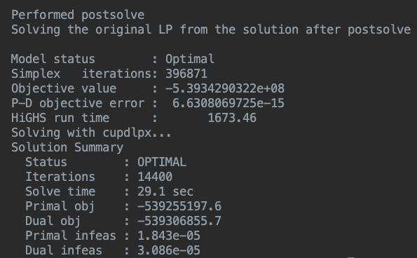

# Accelerating the design of an energy park using GPUs

Currently performing benchmarking of [cuPDLPx](https://github.com/MIT-Lu-Lab/cuPDLPx) vs [HiGHS](https://ergo-code.github.io/HiGHS/dev/interfaces/python/) for industrial-scale energy park design problem from [this publication](https://github.com/mal84emma/Energy-Park-Design).

Initial testing shows a 60x speed-up from GPU acceleration for a stochastic program with 10 scenarios, and even higher speed-ups for larger problems (over 100x for 25 scenario program used in paper). Solution accuracy is looking good so far.



## Next steps

- Perform more thorough benchmarking and project speed-ups for large-scale problems
- Investigate how to get even larger speed-ups using distributed solving across multiple GPUs

<br/>

## Requirements

A suitable environment for running this code can be initialised using [conda](https://docs.conda.io/projects/conda/en/latest/user-guide/tasks/manage-environments.html#) as follows:

```
conda create --name epgpu python=3.11
conda activate epgpu
cd <cupdlpx dir>
pip install -e .
cd <linopy-gpu dir>
pip install -e .
pip install -r requirements.txt
```

## Scripts

- `benchmark_solvers.py`, compare solve times of HiGHS and cuPDLPx