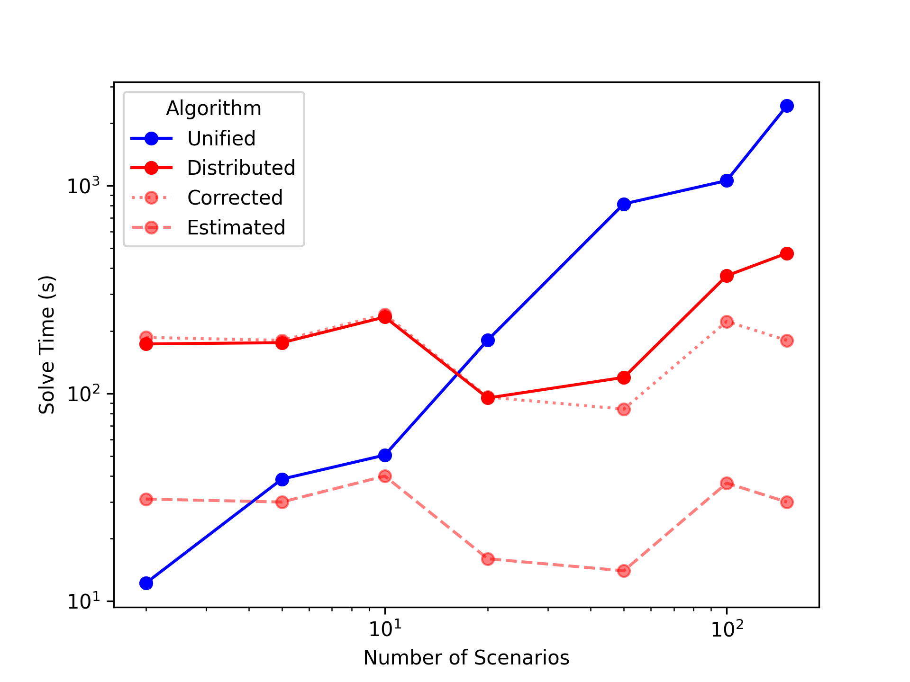
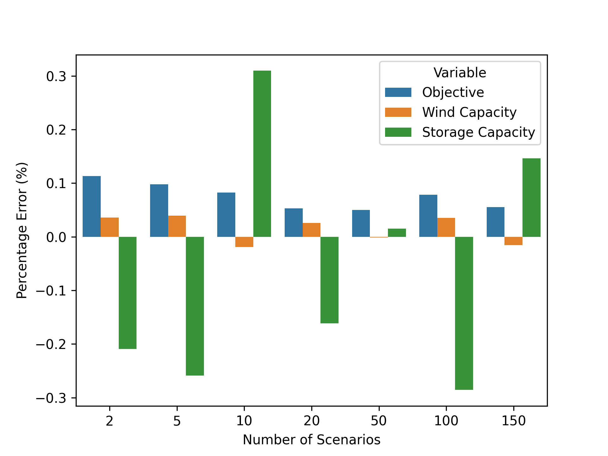

# Solving large stochastic programs on GPU arrays

An efficient method for solving Stochastic Programs (SPs) on distributed hardware by exploiting dual values as gradients.

_Jump to [installation](#installation)|[usage](#usage)._

## Headline results

- Simulation of distributed algorithm on single GPU, testing practical stochastic sizing optimisation problem from [this paper](https://www.sciencedirect.com/science/article/pii/S0360544225032426).
- Distributed algorithm **10x faster than standard approach** of solving unified problem (single large LP), if one GPU per scenario available.
- **Another 10x speed-up possible** (estimate) if a real distributed system were used (reducing memory transfer requirements) and if a tailored meta-optimisation approach were implemented.

#### Solve time results


> All solve times are with [cuPDLPx](https://github.com/MIT-Lu-Lab/cuPDLPx) solver.<br>
> *Unified* shows solution time if SP solved using single model.<br>
> *Distributed* shows solution time that would have been achieved if enough GPUs were available (sum of max solve times per iteration with single GPU).<br>
> *Corrected* gives results if a memory leak in the existing implementation were fixed (preventing increase in solve times over run).<br>
> *Estimated* provides estimate of solve time on a real distributed system (were repeated sub-problem data transfer is not required).

#### Solution accuracy results


> Percentage error compares solution using distributed algorithm to solution using standard approach (single, unified model for SP, taken as ground truth).

<br/>

## Problem

The goal is to reduce solution times for two-stage Stochastic Programs. These have form,

$$
\min_{x,y_1,\dots,y_N} \frac{1}{N} \sum_n c(d_n)^T \begin{bmatrix} x \\ y_n \end{bmatrix} \quad \text{s.t.  some constraints}
$$

where $x$ is the vector of first-stage decision variables, $(y_1,\dots,y_N)$ are the second-stage decision variable vectors for each scenario, $d_n$ is the data for scenario $n$ sampled from the uncertainty distribution, and $c(d_n)$ is the cost vector for scenario $n$.

The Stochastic Program from [this paper](https://www.sciencedirect.com/science/article/pii/S0360544225032426) for sizing energy storage and generation capacity for an industrial scale energy park is used as a test case.

## Approach

Firstly, we re-express the Stochastic Program as a nested optimisation of the first and second stages,

$$
\min_x \frac{1}{N} \sum_n \underbrace{\min_{y_n} c(d_n)^T \begin{bmatrix} x \\ y_n \end{bmatrix}}_{\text{LP sub-problem}} \quad \text{s.t.  same constraints}
$$

### The trick

Lagrange multipliers (or dual variables) tell us our 'willingness to pay' for violating a constraint. I.e. how much better the objective would be if we could violate the constraint (increase RHS) by one unit.

> This means, if we set the first-stage variables to have some specific value in a sub-problem using an equality constraint, **the dual value corresponding to that constraint tells us the local gradient of the sub-problem objective w.r.t $x$**, accounting for the second-stage constraints.

So, if we solve sub-problem $n$ constraining $x$ to have value $\tilde{x}$,

$$
\min_{y_n} c(d_n)^T \begin{bmatrix} x \\ y_n \end{bmatrix} \quad \text{s.t.} x = \tilde{x} \quad \text{(and usual constraints)}
$$

the corresponding dual value $\lambda_n$ which satisfies complementary slackness,

$$
\lambda_n \left( x - \tilde{x} \right) = 0
$$

is an estimate of the local gradient for the sub-problem,

$$
\lambda_n \approx \left. \frac{d}{dx}\left( \text{constrained sub-objective} \right) \right\rvert_{x=\tilde{x}}
$$

This means we can get the gradient for the overall stochastic optimisation (the meta-optimisation) by accumulating dual values from solving all of the LP sub-problems (**which can be done independently**),

$$
g(\tilde{x}) \approx \frac{1}{N} \sum_n \lambda_n
$$

and we can now use this gradient information for optimisation!

### Intuition

Linear Program solvers typically have $O(n^{2-3})$ computational complexity.

Re-expressing the Stochastic Program and breaking it into LP sub-problems could overcome this quadratic/cubic cost if the meta-optimisation problem (first-stage optimisation) is nicely solvable (though it will no longer be a Linear Program). As we now repeatedly solve a set of sub-problems of fixed size, which could be more efficient as the number of scenarios gets large.

I have some intuition that this meta-optimisation will be *piecewise linear and still convex* (because we're projecting the objective value at the best boundary down to the sub-space of the first-stage variables).

> I haven't tried proving this, but so far all the experiments have used a local minimisation algorithm and found the global optimum, so it's looking promising!

### Algorithm

This makes the algorithm **really simple**.

#### Thing 1
We use some suitable optimisation algorithm for the meta-optimisation.<br>
One which uses gradient information and can handle constraints.
> An important next step is to figure out a more efficient method for this meta-optimisation

#### Thing 2
At each step of the meta-optimisation:
- optimise each scenario independently at the current test point (set values of first-stage variables using equality constraint in sub-problems)
- retrieve the dual values corresponding to these first-stage point constraints to get an estimate of the gradient w.r.t. scenario cost (sub-objective)
- combine the results from each scenario to build up overall cost and gradient estimates
- use these values to make an optimisation step for the meta problem

<br/>

Because the scenarios are optimised independently, these can be done of separate devices, and the results are collected on a coordinator device to make the meta-optimisation step.
> As the method uses duals as gradients to make optimisation steps, I've been referring to this approach as 'dual stepping'

Note: the constraints on the first-stage variables in the meta-optimisation need to be sensibly formulated so that valid solutions for each second stage exist at any test point. Otherwise, individual scenario optimisations will fail and it's not clear how to handle that.

### Nice features

This approach has the following nice features:

- The LP sub-problems can stay in-place on each device, meaning that scenario data only has to be loaded to device once at the beginning of the optimisation (as many practical problems have much larger second stages than first this drastically reduces data transfer requirements).
- On each iteration of the meta-optimisation, only value and gradient information about the first-stage variables needs to be transferred between devices.
- The meta-optimisation problem doesn't get harder as the number of scenarios increases (the number of iterations needed to solve doesn't increase), meaning we can achieve a constant solution time if sufficient hardware is available.
  > In fact the MC estimates of cost and gradient become better with more scenarios, so actually the problem might get easier.
- The decomposition used is physically meaningful (the solution to each scenario is available on the devices and can be used to retrieve distributional information at the end of the optimisation).
- The method is hardware and solver agnostic, anything that can solve LPs and return dual values can be used for the sub-problems.
- This approach can handle really large problems! The only limit on size is that the LP sub-problems have to fit within the memory limits of each distributed node (e.g. 32GB of VRAM for a GPU cluster), the coordinator device only stores first-stage information, so doesn't need much memory at all. This opens the possibility to tackle really large stochastic problems, e.g. TB+ models.
- Adding extra features like risk aversion is super simple, we just adjust the way the scenarios are weighted in the cost and gradient averages.

### Disclaimer

I'm not an optimisation algorithms researcher, so I don't know what other people have done in this space or how new idea this is (or more likely which 60s optimisation legend already thought of it).

But it's super fun, and I hope useful.

## Results

Here's a slightly deeper dive into the results.

### Experiments

- The experiments were performed using a T1000 GPU with 4GB of VRAM (not exactly a great GPU).
- All optimisations were performed using the [cuPDLPx](https://github.com/MIT-Lu-Lab/cuPDLPx) GPU accelerated LP solver via the [linopy-gpu](https://github.com/mal84emma/linopy-gpu) interface.
- Stochastic Programs with between 2 and 150 scenarios were tested (150 is the maximum problem size that would fit on the GPU for this test case).

### Solve time

To simulate the performance improvement of the distributed algorithm with multiple GPUs available, the algorithm was run solving each of the independent scenario sub-problems sequentially on a single GPU. The total runtime was estimated as the sum of the maximum solve times per iteration of the meta-optimisation (*Distributed* in plot below).

This was compared to the solve time for the standard approach where the Stochastic Program is solved as a single large Linear Program (*Unified* in plot below).

In the current implementation there's a memory leak (each time a sub-problem is solved, the memory isn't fully cleaned up, leading to increasing solve times as the run progresses). The *Corrected* line shows the estimated solve times if this memory leak were fixed (it takes the average solve time over the first few iterations where it isn't affected by the memory leak, and multiplies this by number of meta-optimisation iterations).

Finally, the *Estimated* line shows the estimated solve times if the algorithm were run on a real distributed system. Currently, solving a sub-problem requires the data for that scenario to be transferred to the device each time. But on a real distributed system, the data could be loaded to each device once at the start of the optimisation, and remain in-place for the whole run, greatly reducing runtime. The [cuPDLPx](https://github.com/MIT-Lu-Lab/cuPDLPx) solver log shows a solve time of 0.5-0.75s for each sub-problem once data is in-place. So 1s per meta-optimisation iteration is taken as a reasonably achievable iteration time on a distributed system (allowing some time for communication & interface overheads).


First off, [cuPDLPx](https://github.com/MIT-Lu-Lab/cuPDLPx) is already a super fast solver. I was really impressed with how quick the unified approach was, so being able to make improvements on this was exciting.

There are a couple of interesting things to note from these results:
1. The number of iterations needed to solve the meta-optimisation doesn't increase with number of scenarios. I.e. the meta problem isn't getting harder as more scenarios are added and the mean cost estimate improves. This means that if sufficient hardware were available, the solution time could be kept constant as number of scenarios increases!
2. The estimated solutions times are really promising. The ability to solve a large-scale stochastic design optimisation with 100+ scenarios in 30s would be game changing for energy practitioners, and would enable a whole new level of design iteration and handling of uncertainty in energy planning (and many other fields).<br>
**And**, many aspects of this approach are still seriously unoptimised, so there are further speed-ups left to chase.

### Solution accuracy

Finally, the distributed approach also managed to provide solutions that were pretty close to the standard unified approach. From the perspective of practical energy system design, tolerances of 0.1-0.3% are likely acceptable.

The interesting thing to note here is that the meta-optimisation used a pretty basic off-the-shelf optimiser (the 'trust region constrained' algorithm from `scipy.optimize.minimize`), which honestly isn't especially well suited to this problem, but still works.<br>
It's also a local optimisation algorithm, but in every test it managed to find the global optimum, which suggests that the meta-optimisation is convex (at least for this problem).

The solution quality/accuracy will depend on both the solver used for the sub-problems (e.g. first-order methods like PDLP don't give as accurate solutions as interior point methods), and the meta-optimisation algorithm used. There's lots to explore here about how solution accuracy can be improved and traded off against solve time. But the initial results are a good start.


## Next steps

These results are still very much preliminary, but show some interesting directions to explore further.

There are some very easy wins to improve the performance of the distributed algorithm:
- Update the sub-problem models in-place, on-device to minimise data transfer time
- Warm-start each sub-problem with the previous solution to reduce local solution times
- Use a better meta-optimisation algorithm. Currently I'm using the ['trust region constrained' algorithm](https://docs.scipy.org/doc/scipy/reference/optimize.minimize-trustconstr.html), which honestly is not a great choice, and has the following issues:
    - it's very slow to get going (initial steps are very small)
    - it doesn't exploit the piecewise linear nature of the cost surface
    - it spends loads of time near the final solution before terminating (very wasteful)

  I don't think it'd be very hard to find or create a better optimiser for the meta-optimisation problem that takes advantage of its characteristics, and reduces the number of meta steps needed to solve.

<br>

A key question that needs answering is the shape/convexity of the meta-optimisation. I think the meta-optimisation should be piecewise linear and convex, but I haven't proved this, and I've only tested one example problem. But even if it's not, this approach could still be useful.

The method could also be used for other block-structured Linear Programs that aren't stochastic. E.g. flow problems with zones that don't have too many inter-connections.<br>
The core idea of exploiting dual values to get gradients from linear sub-problems could be useful elsewhere.

<br/>

## Installation

A suitable environment for running this code can be initialised using [conda](https://docs.conda.io/projects/conda/en/latest/user-guide/tasks/manage-environments.html#) as follows:

```
conda create --name epgpu python=3.11
conda activate epgpu
pip install git+https://github.com/MIT-Lu-Lab/cuPDLPx.git
pip install git+https://github.com/mal84emma/linopy-gpu.git
pip install -r requirements.txt
```

Note that you must also have a suitable CUDA environment set up to use the GPU accelerated solver [cuPDLPx](https://github.com/MIT-Lu-Lab/cuPDLPx). See its [docs](https://github.com/MIT-Lu-Lab/cuPDLPx) for more info.

## Usage

- `sample_scenarios.py`, generate scenario data for use in the Stochastic Programs.
- `benchmark_solvers.py`, compare solve times with HiGHS and cuPDLPx.
- `distributed_solve.py`, solve the Stochastic Program using the unified and distributed approaches for a given number of scenarios, and save the results (solutions and solve times).
- `plot_results.py`, generate results figures.

## Citing

Please cite as
```
@misc{langtry2025SolvingLargeStochastic,
  author = {Langtry, Max},
  title = {Solving large stochastic programs on GPU arrays},
  month = Nov,
  year = 2025,
  url = {https://github.com/mal84emma/SPs-on-GPU-arrays},
}
```
